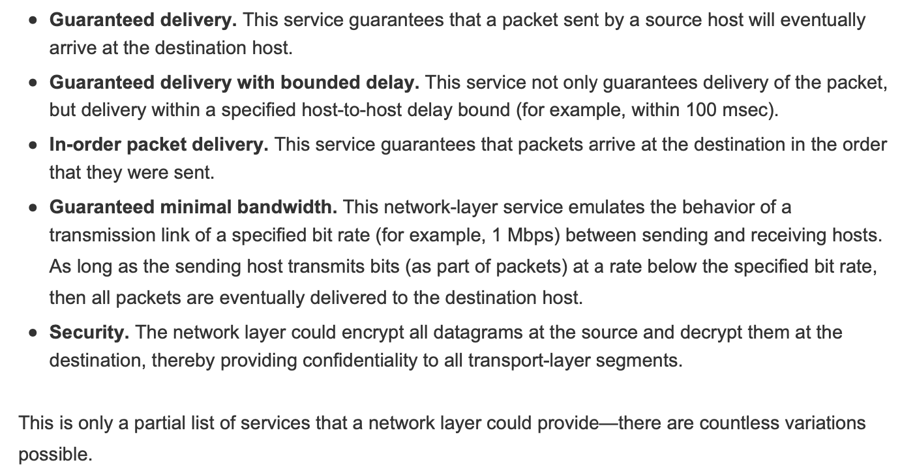
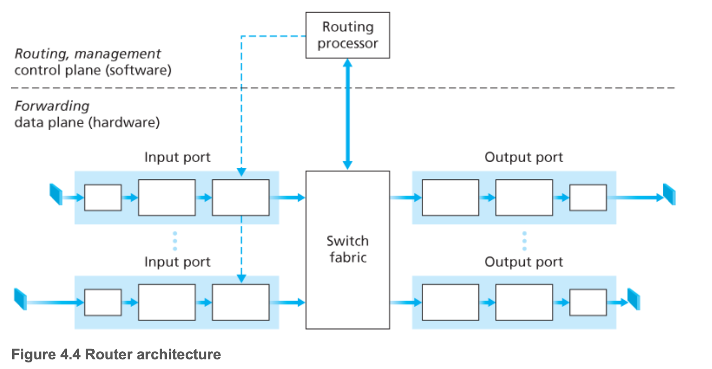
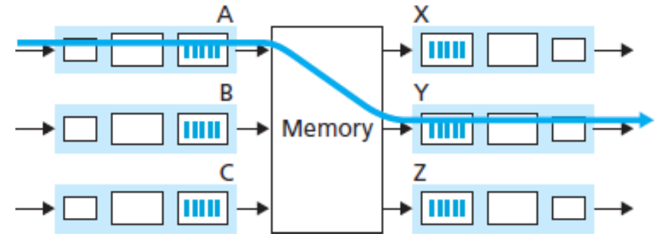
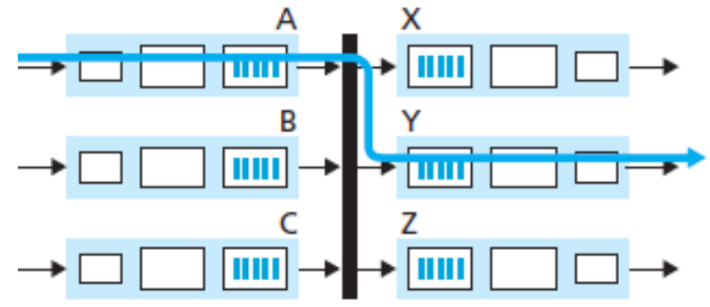
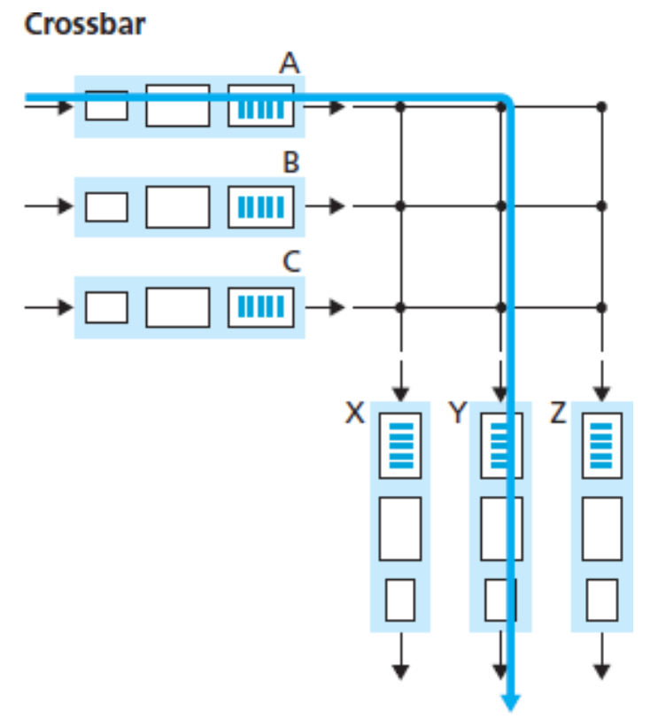
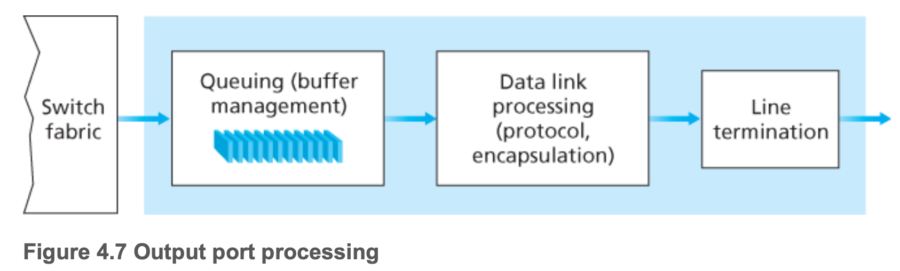

# Network layer data plane
## Forwarding and Routing: The Data and Control Planes
Forwarding: 
* When a packet arrives at a router’s input link, the router must move the packet to the appropriate output link.
* Implemented in the data plane

Routing:
* determine the route or path taken by packets as they flow from a
sender to a receiver.
* Implemented in the control plane

## Network Service Model

The Internet’s network layer provides a single service, known as best-effort service. With best-effort service, packets are neither guaranteed to be received in the order in which they were sent, nor is their eventual delivery even guaranteed. There is no guarantee on the end-to-end delay nor is there a minimal bandwidth guarantee.

## What's inside a router

* Input ports:
1. pysical layer function, teminating an incoming physical link at a router
2. link-layer function
3. look-up function, routing table is consulted. The forwarding table is copied from the routing processor to the line cards over a separate bus (e.g., a PCI bus) indicated by the dashed line from the routing processor to the input line cards in Figure 4.4.

* Switching fabric
* output ports:
1. stores packets received from switching fabric
2. transmits these packets on the outgoing link by performing the necessary link-layer and physical-layer functions
3. When a link is bidirectional (that is, carries traffic in both directions), an output port will typically be paired with the input port for that link on the same line card.
* Routing processor:

performs control-plane functions

In traditional routers
1. executes the routing protocols 
2. maintains routing tables
3. attached link state information
4. computes the forwarding table for the router

In SDN routers
1. responsible for communicating with the remote controller in order to (among other activities) receive forwarding table entries computed by the remote controller
2. install these entries in the router’s input ports

The routing processor also performs the network management functions

Usually, we use prefix in forwarding table to determine which interface this packets should go out through.

When multiple matches exsits, the router uses the longest prefix matching rule.

Although this rule is simple, at Gigabit transmission rates, this lookup must be performed in nanoseconds, so techniques beyond simple linear search through a large table are needed.(refer to p363)

Once a packet's output has been determined via the lookup, the packet can be sent into the fabric.

In some designs, a packet may be temporarily blocked from entering the switching fabric.

A blocked packet will be queued at the input port and then scheduled to cross the fabric later.

Except lookup in input port processing, many other actions must be taken: 

(1) physical- and link-layer processing must occur

(2) the packet’s version number, checksum and time-to-live field—all must be checked and the latter two fields rewritten
  

(3) counters used for network management (such as the number of IP datagrams received) must be updated.

## Switching

Switching can be accomplished in a number of ways.

1. switching via memory: earliest routers were traditional computers. Input and output ports functioned as traditional I/O devices in a traditional operating system. First, An input port with an arriving packet signaled the routing processor via an interrupt. Second, the packet was copied from the input port into processor memory. Finally, the routing processor extracted the destination address from the header, looked up the appropriate output port in the forwarding table, and copied the packet to the output port’s buffers.

In this scenario, if the memory bandwidth is such that a maximum of B packets per second can be written into, or read from, memory, then the overall forwarding throughput (the total rate at which packets are transferred from input ports to output ports) must be less than B/2. Note also that two packets cannot be forwarded at the same time, even if they have different destination ports, since only one memory read/write can be done at a time over the shared system bus.

Some modern routers switch via memory. A major difference from early routers, however, is that the lookup of the destination address and the storing of the packet into the appropriate memory location are performed by processing on the input line cards. In some ways, routers that switch via memory look very much like shared-memory multiprocessors, with the processing on a line card switching (writing) packets into the memory of the appropriate output port. Cisco’s Catalyst 8500 series
switches [Cisco 8500 2016] internally switches packets via a shared memory.

2. Switching via a bus: An input port transfers a packet directly to the output port over a shared bus, without intervention by the routing processor. a. Typically done by having the input port pre-pend a switch-internal label (header) to the packet indicating the local output port to which this packet is being transferred and transmitting the packet onto the bus. b. All output ports receive the packet, but only the port that matches the label will keep the packet. c. The label is then removed at the output port, as this label is only used within the switch to cross the bus. If multiple packets arrive to the router at the same time, each at a different input port, all but one must wait since only one packet can cross the bus at a time, so the switching speed of the router is limited to the bus speed. The Cisco 6500 router[Cisco 6500 2016] internally switches packets over a 32-Gbps-backplane bus.

3. Switching via an interconnection network: A crossbar switch is an interconnection network consisting of 2N buses that connect N input ports to N output ports. Each vertical bus intersects each horizontal bus at a crosspoint, which can be opened or closed at any time by the switch fabric controller (whose logic is part of the switching fabric itself). Unlike the previous two switching approaches, crossbar switches are capable of forwarding multiple packets in parallel. A crossbar switch is non-blocking—a packet being forwarded to an output port will not be blocked from reaching that output port as long as no other packet is currently being forwarded to that output port. Cisco 12000 series switches [Cisco 12000 2016] use a crossbar switching network; the Cisco 7600 series can be configured to use either a bus or crossbar switch [Cisco 7600 2016]. A router’s switching capacity can also be scaled by running multiple switching fabrics in parallel. In this approach, input ports and output ports are connected to N switching fabrics that operate in parallel. An input port breaks a packet into K smaller chunks, and sends (“sprays”) the chunks through K of these N switching fabrics to the selected output port, which reassembles the K chunks back into the original packet.

## Output Port Processing

Output port processing, shown in Figure 4.7, takes packets that have been stored in the output port’s memory and transmits them over the output link. This includes selecting and de-queueing packets for transmission, and performing the needed link-layer and physical-layer transmission functions.

# Network plane Control plane

## Intra-AS Routing in the Internet: OSPF

